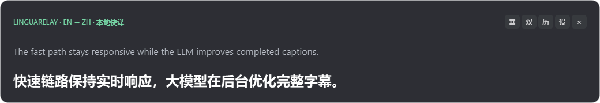
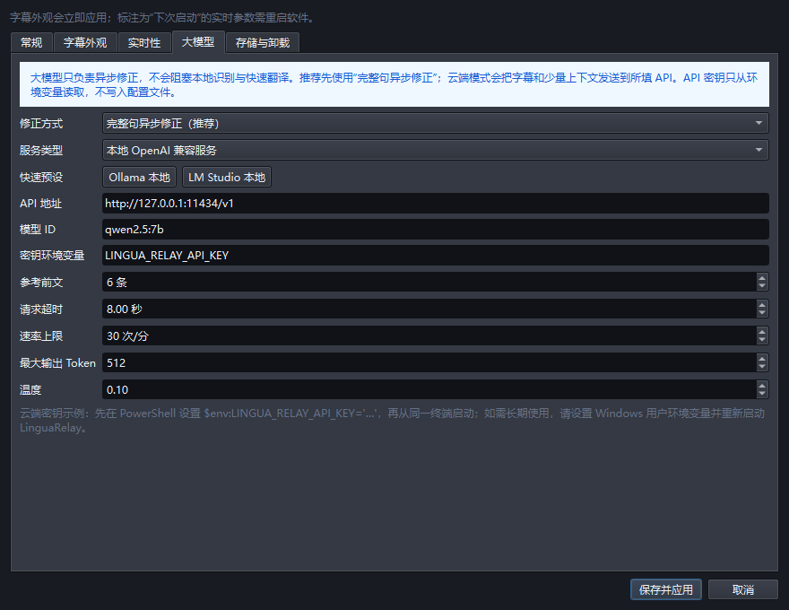
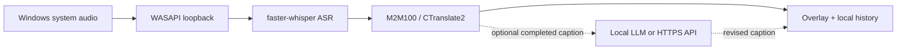

<div align="center">
  
  <h1>LinguaRelay</h1>
  <p><strong>Real-time translation captions for Windows system audio.</strong></p>
  <p>Local-first, low-latency, and ready for optional LLM revision.</p>
  <p>
    <a href="README.zh-CN.md">简体中文</a> ·
    <a href="docs/ARCHITECTURE.md">Architecture</a> ·
    <a href="docs/ROADMAP.zh-CN.md">Roadmap</a> ·
    <a href="https://github.com/MuzeAnisichael/LinguaRelay/issues/new/choose">Feedback</a>
  </p>
  <p>
    <a href="https://github.com/MuzeAnisichael/LinguaRelay/releases/latest"></a>
    <a href="https://github.com/MuzeAnisichael/LinguaRelay/actions/workflows/ci.yml"></a>
    <a href="LICENSE"></a>
    
  </p>
  <p>
    <a href="https://github.com/MuzeAnisichael/LinguaRelay/releases/tag/v0.1.5"><strong>Download v0.1.5</strong></a>
    · <a href="#quick-start">Quick start</a>
    · <a href="docs/releases/v0.1.5.md">Release notes</a>
  </p>
</div>



LinguaRelay listens to a selected Windows speaker output, recognizes speech, and
shows the translation in a compact always-on-top overlay. Chinese, Japanese,
English, and Korean are supported in every direction. The source language stays
manual by design, avoiding language-detection delay and accidental route changes.

> [!IMPORTANT]
> v0.1.5 is an unsigned Windows x64 alpha. Download it only from this repository,
> verify `SHA256SUMS.txt`, and expect Windows to show an unknown-publisher warning.

## Why LinguaRelay?

| | |
|---|---|
| **Fast first result** | Partial recognition appears early; local machine translation does not wait for an LLM. |
| **Four languages, 12 routes** | Manually selected `zh`, `ja`, `en`, and `ko`, with every ordered source/target pair supported. |
| **Local by default** | Audio stays in memory, model inference runs locally, and caption history can be disabled. |
| **LLM when useful** | A local model or opt-in HTTPS API can revise completed captions without blocking the live path. |

## Quick start

1. Open [v0.1.5 on GitHub Releases](https://github.com/MuzeAnisichael/LinguaRelay/releases/tag/v0.1.5)
   and download `LinguaRelay-0.1.5-Setup-x64.exe`.
2. On first launch, let LinguaRelay verify an existing model directory or choose
   a model profile. The installer does not silently download model weights.
3. Select the source language, target language, and speaker output from the tray
   menu. Play audio and position the overlay where you want it.

Prefer not to install? The release also includes
`LinguaRelay-0.1.5-Windows-x64-portable.zip`. Both editions can use an offline
model ZIP from the same release.

### Choose a model profile

| Profile | Installed size | Best for |
|---|---:|---|
| **Balanced / Small** (recommended) | about 1.36 GiB | 16 GB RAM, a recent six-core CPU, or an NVIDIA GPU; better recognition quality |
| **Lightweight / Base** | about 1.05 GiB | 8 GB RAM, CPU-only use, or lower-power laptops; lower resource use |

Both profiles use the same local translation model and support all 12 language
routes. Existing and offline model packs are fully hash-verified before use.
See [model choices and licenses](docs/MODELS.md) for revisions and benchmarks.

## What it can do

- Capture the default or a selected Windows output device through WASAPI loopback,
  with automatic reconnect and bounded fresh-first queues.
- Stream multilingual `faster-whisper` partials, show recognized text before the
  newest translation finishes, and end captions at stable punctuation, short
  pauses, or a six-second hard limit.
- Translate all 12 routes locally with one warmed M2M100/CTranslate2 model.
- Drag and resize the overlay; switch between translated-only and bilingual
  modes; customize retention time, fonts, colors, opacity, and click-through.
- Pause, switch display mode, open history/settings, or hide the window directly
  from the compact overlay controls.
- Search and filter local history, inspect revisions, copy captions, and export
  JSONL, CSV, or SRT.
- Filter short credit-like hallucinations over music or silence, including the
  common “subtitle by …” pattern.
- Remove the verified local model pack independently, or launch the Windows
  uninstaller while keeping settings and history by default.

## Optional LLM revision



Open **Settings → LLM** to choose completed-caption revision (recommended) or
experimental live revision. LinguaRelay supports local OpenAI-compatible servers
such as Ollama and LM Studio, plus opt-in HTTPS OpenAI-compatible APIs.

The fast local translation is always displayed first. Timeouts, rate limits,
disconnects, or an unavailable correction model do not stop live captions. API
keys are read from a named environment variable and are never written to the
TOML configuration or caption history. See the
[v0.1.5 setup guide](docs/releases/v0.1.5.md#大模型接入) for the UI steps.

## How it works



The solid path owns responsiveness. The optional revision path owns context,
terminology, punctuation, and retrospective cleanup. This separation keeps the
caption window useful when the LLM is slow or offline.

## Privacy and current limits

- Loopback capture can include meetings, notifications, media, and any other
  sound played through the selected output device.
- Raw audio is processed in memory and is not saved by default. Caption history
  is local and can be disabled.
- A cloud correction provider receives caption text, recent text context, and
  matching glossary entries only after the user enables it.
- Windows 10/11 x64 is the current supported platform. Automatic language
  detection is intentionally unavailable in this release.
- Speech and translation quality varies with audio, accents, terminology, and
  hardware. The bundled benchmark results are engineering gates, not universal
  accuracy claims.

Read the full [privacy note](docs/PRIVACY.zh-CN.md),
[threat model](docs/THREAT_MODEL.md), and [security policy](SECURITY.md) before
using LinguaRelay with sensitive audio.

## Development

Python 3.11 is recommended:

```powershell
python -m venv .venv
.\.venv\Scripts\Activate.ps1
python -m pip install -e ".[dev,audio,asr,translation]"
lingua-relay doctor
lingua-relay app
```

Before opening a pull request:

```powershell
ruff check .
ruff format --check .
pytest
```

Product screenshots can be refreshed with
`python scripts/capture_readme_screenshots.py`. Packaging instructions live in
[docs/RELEASE.md](docs/RELEASE.md).

## Documentation

| Document | Purpose |
|---|---|
| [Architecture](docs/ARCHITECTURE.md) | Fast path, queue boundaries, desktop runtime, and revision path |
| [Model choices](docs/MODELS.md) | Install profiles, exact revisions, licenses, and performance notes |
| [v0.1.5 design](docs/OPTIMIZATION-v0.1.5.zh-CN.md) | First optimization plan and its product trade-offs |
| [Benchmarks](docs/benchmarks/README.md) | Reproducible release and latency evidence |
| [Release process](docs/RELEASE.md) | Windows build, installer, checksums, SBOM, and publishing |
| [Roadmap](docs/ROADMAP.zh-CN.md) | Planned work after the first public releases |

## Contributing

Bug reports, translation-quality samples, performance measurements, and focused
pull requests are welcome. Please use the structured
[issue forms](https://github.com/MuzeAnisichael/LinguaRelay/issues/new/choose)
and read [CONTRIBUTING.md](CONTRIBUTING.md). Never attach private recordings,
API keys, or unredacted caption history.

## License

LinguaRelay source code is available under the [MIT License](LICENSE).
Downloaded model weights retain their upstream licenses; see
[THIRD_PARTY.md](THIRD_PARTY.md). Project author and copyright holder:
**Leeleelee**.
