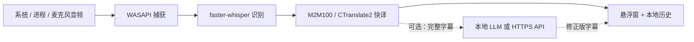

<div align="center">
  
  <h1>LinguaRelay</h1>
  <p><strong>把电脑里的声音，实时变成你能读懂的翻译字幕。</strong></p>
  <p>本地优先、低延迟，并可选用大模型在后台修正译文。</p>
  <p>
    <a href="README.md">English</a> ·
    <a href="docs/ARCHITECTURE.md">架构</a> ·
    <a href="docs/ROADMAP.zh-CN.md">路线图</a> ·
    <a href="https://github.com/MuzeAnisichael/LinguaRelay/issues/new/choose">反馈问题</a>
  </p>
  <p>
    <a href="https://github.com/MuzeAnisichael/LinguaRelay/releases/latest"></a>
    <a href="https://github.com/MuzeAnisichael/LinguaRelay/actions/workflows/ci.yml"></a>
    <a href="LICENSE"></a>
    
  </p>
  <p>
    <a href="https://github.com/MuzeAnisichael/LinguaRelay/releases/tag/v0.2.0"><strong>下载 v0.2.0</strong></a>
    · <a href="#快速开始">快速开始</a>
    · <a href="docs/releases/v0.2.0.md">发布说明</a>
  </p>
</div>


LinguaRelay 可在后台监听 Windows 系统输出、指定进程或麦克风，识别其中的语音，再把译文显示在简洁的置顶悬浮窗中。支持中文、日语、英语、韩语全部 12 个互译方向。源语言由用户手动选择，以避免自动检测带来的等待和语言方向误切换。

> [!IMPORTANT]
> v0.2.0 是尚未签名的 Windows x64 Alpha 版本。请只从本仓库下载，使用
> `SHA256SUMS.txt` 校验文件；Windows 显示“未知发布者”属于当前版本的已知情况。

## 为什么使用 LinguaRelay？

| | |
|---|---|
| **先快后精** | 识别结果尽早出现，本地快译不会等待大模型。 |
| **三种音频源** | 可捕获全部系统输出、单个进程及其子进程，或指定麦克风。 |
| **四语全部互译** | 手动选择 `zh`、`ja`、`en`、`ko`，覆盖全部 12 个源语言/目标语言组合。 |
| **默认本地处理** | 音频只在内存中流转，识别与快译使用本地模型，字幕历史可以关闭。 |
| **按需接入 LLM** | 本地大模型或用户主动启用的 HTTPS API 可以异步修正完整字幕，不阻塞实时链路。 |

## 快速开始

1. 打开 [GitHub Releases 的 v0.2.0 页面](https://github.com/MuzeAnisichael/LinguaRelay/releases/tag/v0.2.0)，下载 `LinguaRelay-0.2.0-Setup-x64.exe`。
2. 首次启动时，让 LinguaRelay 校验已有模型目录，或选择一种模型方案。安装程序不会在没有提示的情况下静默下载模型。
3. 在托盘菜单中选择源语言、目标语言和系统输出/指定进程/麦克风。播放音频，再把悬浮窗拖动、缩放到合适位置。

不想安装也可以使用 `LinguaRelay-0.2.0-Windows-x64-portable.zip`。安装版和便携版都能复用 v0.1.5 的基础离线模型 ZIP。

### 如何选择模型

| 方案 | 安装后体积 | 适合场景 |
|---|---:|---|
| **均衡版 / Small**（推荐） | 约 1.36 GiB | 16 GB 内存、较新的六核 CPU 或 NVIDIA GPU；更重视识别质量 |
| **轻量版 / Base** | 约 1.05 GiB | 8 GB 内存、纯 CPU 或低功耗笔记本；更重视资源占用 |

两个方案使用相同的本地翻译模型，都支持全部 12 个语言方向。已有模型和离线模型包只有通过完整哈希校验后才会被采用。模型版本、许可证和测试数据见[模型选择说明](docs/MODELS.md)。

首次启动后，还可在“**用户设置 → 识别与翻译**”中选择多语言 Medium、Large-v3 Turbo 识别模型，以及 M2M100 1.2B 翻译模型。软件会在保存前明确提示缺失模型、下载体积和硬件建议；高级模型只在用户确认后下载，并支持断点续传。

## 主要功能

- 通过 WASAPI 捕获默认/指定的 Windows 输出设备、单个进程及其子进程，或麦克风；音频源中断后自动重连，有界新数据优先队列避免延迟无限累积。
- 使用多语言 `faster-whisper` 流式输出 partial；先显示识别原文，在最新译文尚未完成时不让界面空等；遇到稳定句末标点、短停顿或六秒硬上限时断句。
- 使用一个预热的 M2M100/CTranslate2 本地模型，直接覆盖四种语言全部 12 个互译方向。
- 悬浮窗支持拖动、四边/四角缩放、仅译文/双语切换、字幕保留时间、字体、颜色、透明度和点击穿透。
- 可直接在悬浮窗上暂停、切换显示方式、打开历史/设置或隐藏窗口。
- 本地历史支持搜索、语言与版本筛选、详情查看、复制，并可导出 JSONL、CSV 或 SRT。
- 可过滤音乐或静音中常见的“字幕制作人……”一类短署名幻觉；需要时也能在设置中关闭过滤。
- 可以只卸载经过校验的本地模型，也可以从应用中启动 Windows 卸载程序；配置和字幕历史默认保留。

## 可选的大模型修正


打开“**用户设置 → 大模型**”，可选择推荐的“完整句异步修正”，或实验性的实时异步修正。支持 Ollama、LM Studio 等本地 OpenAI-compatible 服务，也支持用户主动配置的 HTTPS OpenAI-compatible API。

本地快译始终优先显示。即使大模型超时、限流、断线或不可用，实时字幕也会继续工作。API 密钥只从指定环境变量读取，不写入 TOML 配置或字幕历史。图形化设置步骤见 [v0.2.0 发布说明](docs/releases/v0.2.0.md#大模型接入)。

## 工作方式



实线链路负责实时性；可选修正链路负责上下文、术语、标点与后期整理。两条链路分离后，大模型速度较慢或离线时，字幕窗仍然可用。

## 隐私与当前限制

- 回环捕获可能包含会议、通知、媒体和所选设备播放的其他声音。
- 原始音频默认只在内存中处理，不写入磁盘；本地字幕历史可以关闭。
- 只有用户主动开启云端修正后，字幕文本、少量文本上下文和命中的术语表内容才会发送给所选服务。
- 当前正式支持 Windows 10/11 x64；本版本有意不提供自动语言检测。
- 按进程捕获要求 Windows 10 2004 或更高版本。受 DRM 保护的音频、绕过 Windows 音频引擎的应用可能无法捕获。
- 识别和翻译质量会受到音质、口音、术语和硬件影响；仓库中的基准结果是工程门槛，不代表所有场景下的准确率。

在敏感场景使用前，请阅读完整的[隐私说明](docs/PRIVACY.zh-CN.md)、[威胁模型](docs/THREAT_MODEL.md)和[安全策略](SECURITY.md)。

## 本地开发

建议使用 Python 3.11：

```powershell
python -m venv .venv
.\.venv\Scripts\Activate.ps1
python -m pip install -e ".[dev,audio,asr,translation]"
lingua-relay doctor
lingua-relay app
```

提交 Pull Request 前运行：

```powershell
ruff check .
ruff format --check .
pytest
```

使用 `python scripts/capture_readme_screenshots.py` 可以重新生成 README 中的产品截图。Windows 打包与发布流程见 [docs/RELEASE.md](docs/RELEASE.md)。

## 文档导航

| 文档 | 内容 |
|---|---|
| [系统架构](docs/ARCHITECTURE.md) | 快速链路、队列边界、桌面运行时和修正链路 |
| [模型选择](docs/MODELS.md) | 安装方案、固定版本、许可证和性能说明 |
| [v0.1.5 优化设计](docs/OPTIMIZATION-v0.1.5.zh-CN.md) | 第一版综合优化方案与产品取舍 |
| [基准与验证](docs/benchmarks/README.md) | 可复现的延迟、质量和发布门槛证据 |
| [发布流程](docs/RELEASE.md) | Windows 构建、安装包、校验值、SBOM 与发布 |
| [项目路线图](docs/ROADMAP.zh-CN.md) | 首个公开版本后的计划 |

## 参与贡献

欢迎提交缺陷报告、翻译质量样本、性能数据和边界清晰的 Pull Request。请优先使用结构化的 [Issue 表单](https://github.com/MuzeAnisichael/LinguaRelay/issues/new/choose)，并阅读 [CONTRIBUTING.md](CONTRIBUTING.md)。不要上传私人录音、API 密钥或未脱敏的字幕历史。

## 开源许可

LinguaRelay 源代码使用 [MIT License](LICENSE)。下载的模型权重继续遵守各自的上游许可证，详见 [THIRD_PARTY.md](THIRD_PARTY.md)。项目作者及版权所有者：**Leeleelee**。
